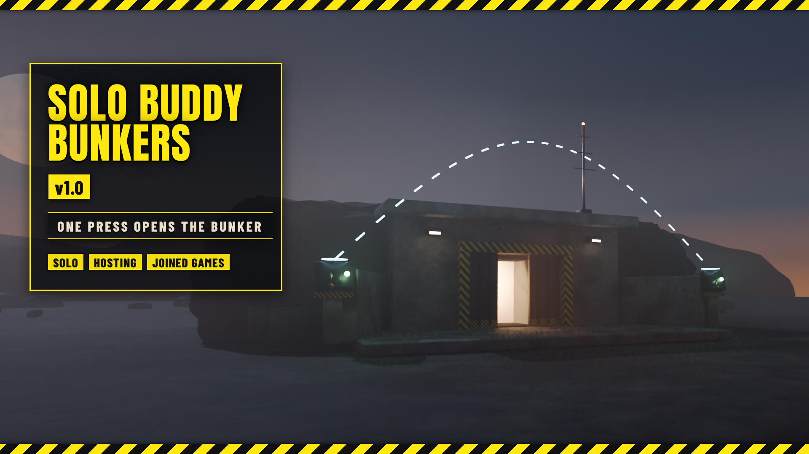

# Solo Buddy Bunkers

*Press one switch of a two-person bunker and the other one is pressed for you.*

**Download:** `Solo-Buddy-Bunkers-1.0.0.zip` from the [latest release](https://github.com/Th3chef/Solo-Buddy-Bunkers/releases/latest) (not the source code). Needs [Bingus Shared Loader](https://www.nexusmods.com/helldivers2/mods/16292) v19 or newer.

Buddy bunkers are the two-person bunkers with a switch on each side of the door: both switches have to be pressed within a few seconds of each other to open the door. With this mod you press one switch, the other switch of the same bunker is pressed for you, and the door opens. No more running back and forth, and no more waiting for a squadmate to come over.

## Features

- **One press opens the bunker:** press either switch; the mod presses the other switch of the same bunker for you.
- **Solo and hosting:** the other switch is pressed through the game's own switch, with the same effects and the same door signal as a second player pressing it. When you host, it works for a press by anyone in your game.
- **Joined games:** when you've joined someone else's game, your game sends the host a press of the other switch, through the same interaction your own press uses. The host doesn't need the mod.
- **On/off in game:** with [Mod Options Menu](https://www.nexusmods.com/helldivers2/mods/16625), a toggle under ESC > MODS > SOLO BUDDY BUNKERS.
- **Light:** about 0.01 ms a frame. In missions without buddy bunkers, on the ship and in menus it does next to nothing.

## Options

No options in the mod manager. With [Mod Options Menu](https://www.nexusmods.com/helldivers2/mods/16625) installed, **Open buddy bunkers alone** (on to start) turns it on and off in game, under ESC > MODS > SOLO BUDDY BUNKERS.

## Requirements

[Bingus Shared Loader](https://www.nexusmods.com/helldivers2/mods/16292) v19 or newer.
Optional: [Mod Options Menu](https://www.nexusmods.com/helldivers2/mods/16625) for the in-game toggle.

## Install / update

1. Install [Bingus Shared Loader](https://www.nexusmods.com/helldivers2/mods/16292) v19 or newer if you don't have it.
2. Mod manager (Arsenal / HD2 Mod Manager): add `Solo-Buddy-Bunkers-1.0.0.zip` and enable it, then **Purge** and **Deploy**.

## Uninstall

Disable it in your mod manager, then Purge and Deploy. Its log and cache files stay in the Bingus logs folder and can be deleted.

## Compatibility

- A Bingus Shared Loader script: it doesn't replace any game files, so it works alongside other mods.
- Works solo, when you host, and when you join someone else's game. Nobody else needs the mod.
- It only acts when a buddy bunker switch is pressed, and only presses that bunker's other switch (the nearest switch of the other side, a few meters away).
- Patch-proof by design: it finds what it needs in the game's code by itself after a game update. The solo/host part and the joined-game part are found separately, so if an update breaks one, the other keeps working. If something can't be found, that part turns itself off and says so in its log, rather than guessing.
- Made and tested on the October 2026 game version.

## Known limitations

- In a joined game it acts on your own presses only (a squadmate's press is the host's game to handle).
- If the host's game ever refuses a press from a player standing at the other switch, a joined-game press won't open the bunker; nothing else is affected. (It hasn't happened in testing.)

## How it works

A Bingus Shared Loader Lua addon.
- **Solo or hosting:** your game runs the bunker's switches. The mod watches the switches' states, and when one is freshly pressed, it calls the game's own press routine for the other switch of the same bunker, so the game handles the rest (effects, the door).
- **Joined:** the switches run in the host's game. When you press a switch, your game sends the host an interaction request and keeps a short note of it while it waits for the answer. When that note names a bunker switch, the mod sends the host the same request for the other switch, through the same game routine.
- The game's addresses are found by searching the game's code at start-up and cached per game build.

## Troubleshooting

- It doesn't open the bunker: check Bingus Shared Loader v19 or newer is installed, the mod is enabled (and on in Mod Options Menu, if you use it), and that you Purged and Deployed after installing.
- Attach the logs to a bug report: *SoloBuddyBunkers.log* and *BingusSharedLoader.log* in `%LOCALAPPDATA%\CowboyBingus\Helldivers2\Logs` (type %LOCALAPPDATA% into the File Explorer address bar and press Enter). SoloBuddyBunkers.log shows whether it found what it needs in the game's code, and each bunker press it made or left alone and why.

## Building from source

See [src/BUILDING.md](src/BUILDING.md).

## Support

If you like my mods, you can support me on [Patreon](https://www.patreon.com/c/Chefboiardee).

## Credits

- **CowboyBingus**: Bingus Shared Loader and the Mod Options Menu.
- Fonts: Anton and Barlow Condensed (SIL Open Font License).

## License

All rights reserved. See [LICENSE](LICENSE).
